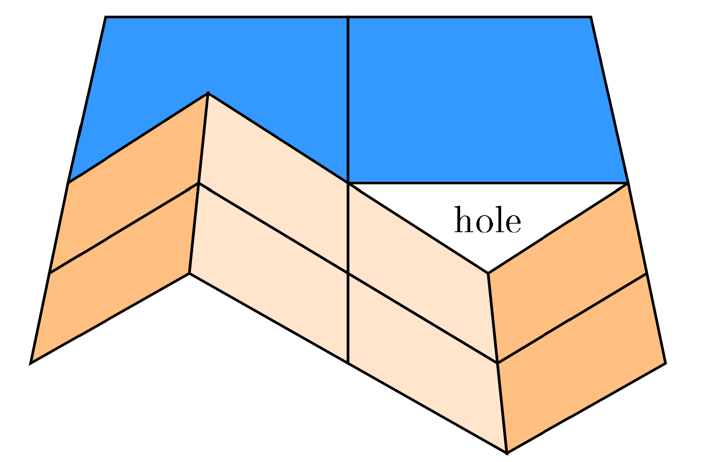

Why pay Unreal Engine money for their Nanite, when we have Nanite at Home?

How hard could it be to replicate it ourselves, with rust-gpu?

TODO Nanite at home meme?

<!-- truncate -->

TODO proper introduction, why Terrain gen before nanite?    

## Triangles, Vertices, Meshes and Level of Detail

:::tip
Feel free to skip this chapter if you already know all these concepts, but I suspect there will be plenty of rust programmers unfamiliar with computer graphics.
:::

TODO pic of some low poly 3D model

You've probably all seen a 3D mesh made up of many triangles, but how do we actually represent them? The triangles themselves are quite simple, it's just a List of u16 or u32 indices where a set of 3 describe the corner IDs to connect to create a triangle. Far more interesting are these corners, we call them vertices, as they often cary not just the position they are located at, but you can attach various other attributes to them. For example, normals can describe the "up" direction of a surface, which is important in lighting calculations. Or texture coordinates to describe how 2D images should be wrapped around our 3D mesh, think of the wrapper around chocolate Easter bunnies. 

As we're writing a renderer, we don't just want to store models, we want to render them to the screen and look at it from different directions! 
For realtime applications you'd typically use a process called "rasterization" to turn a model into colorful pixels on screen, which includes programmable shaders allowing us to manipulate the appearance of our model:
1. The vertex shader runs once per vertex and calculates where our vertex would end up on the screen, but can also change the other attributes attached to the vertex. 
2. A hardware rasterizer assembles the triangles and figures out where they end up on the screen. It then creates a stream of fragments for each pixel the triangle overlaps.
3. The fragment shader evaluates the color of every emitted fragment.

The cost of rendering scales largely by the shaders that need to be run, or in other words: The amount of pixels on screen plus the amount of vertices of the model. 

TODO pic of some different LOD levels

As we move a model further away from the camera, the mesh gets smaller and fewer fragments need to be evaluated. However, we would still need to call the vertex shader for every single vertex to know where it ends up on screen, even if the detail they describe would be too small to notice. To improve performance, it is common practice to not just have a single mesh, but to create multiple meshes at different Level of Detail (LOD) that can be swapped out, depending on the distance to the camera. The process of reducing the amount of geometry of a mesh is called "mesh simplification", 

## Terrain in video games

You've all played or at least seen Minecraft with its infinite worlds made of blocks. We can't draw infinite amounts of geometry, so we need to segment the world into chunks and only load a small amount of them around the player. And as the player moves in some direction, we load new chunks there and unload the ones behind them.
But that alone doesn't lend itself to far view distances, as chunks further from the camera as just as geometrically dense as the one the player is standing in.
We need simplified chunks.

<figure>

<figcaption>[image source](https://www.researchgate.net/publication/342611763_General-Purpose_Real-Time_VR_Landscape_Visualization_with_Free_Software_and_Open_Data)</figcaption>
</figure>

Above you can see a single chunk of a more typical non-blocky game. The white lines indicate the geometry for a 64x64 grid, with a square being represented by 2 triangles each. Compare that to the red geometry representing the same chunk, but with only an 8x8 grid with far fewer geometric detail. By simply using a smaller grid, thus lowering our sampling frequency, we can generate simpler geometry.

TODO rephrase

<figure>

<figcaption>Source: Continuous Distance-Dependent Level of Detail for Rendering Heightmaps</figcaption>
</figure>

A typical approach is to combine a 2x2 of chunks into a larger chunk. If we use a quarter of the vertex density representing four times as much area, every chunk, independent of its LOD, has the exact same amount of vertices and triangles. If we then repeat this process a bunch of times, we can create a chunk system like the one pictured above, with many very detailed chunks near the camera and larger, less detailed chunks the further away we get. 

But as we are building up this data structure, we create a special kind of tree: a Quadtree. Ubiquitous in the computer graphics world, it's a binary tree but in 2 dimensions, where one node splits into four new nodes. For clarity, we will only be visualizing two children per node in our graphs.

## Terrain holes

<figure>

<figcaption>[image source](https://www.researchgate.net/publication/342611763_General-Purpose_Real-Time_VR_Landscape_Visualization_with_Free_Software_and_Open_Data)</figcaption>
</figure>

<figure>

<figcaption>[image source](https://blog.traverseresearch.nl/creating-a-directed-acyclic-graph-from-a-mesh-1329e57286e5)</figcaption>
</figure>

## Nanite

## rust-gpu-bindless

## Epilog
