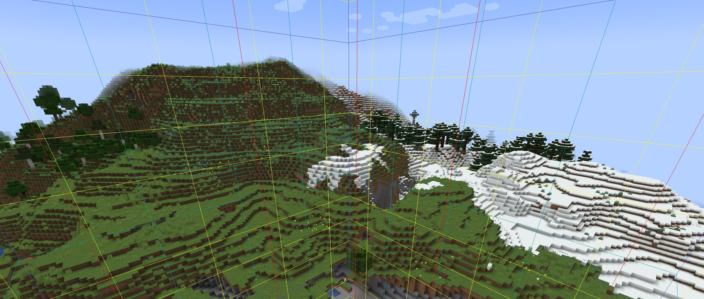
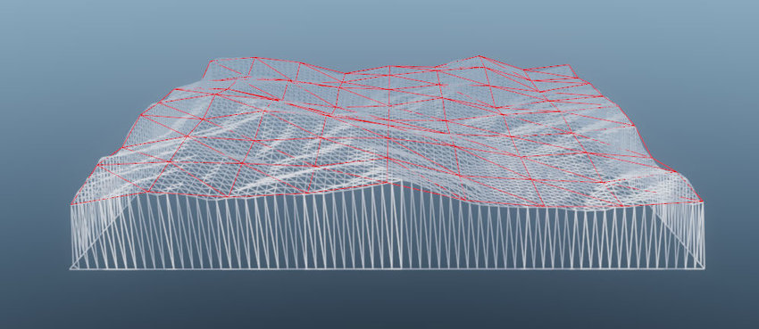
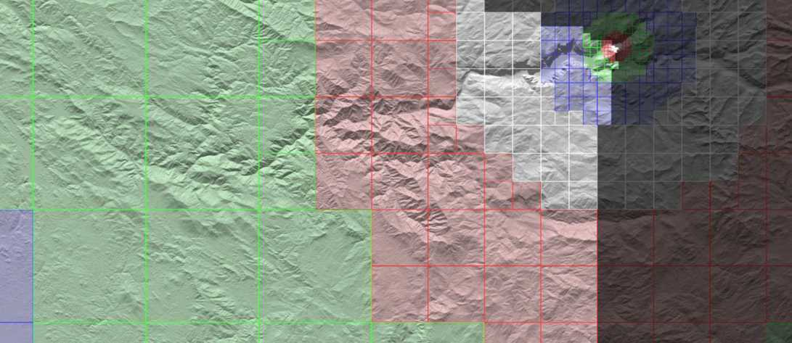
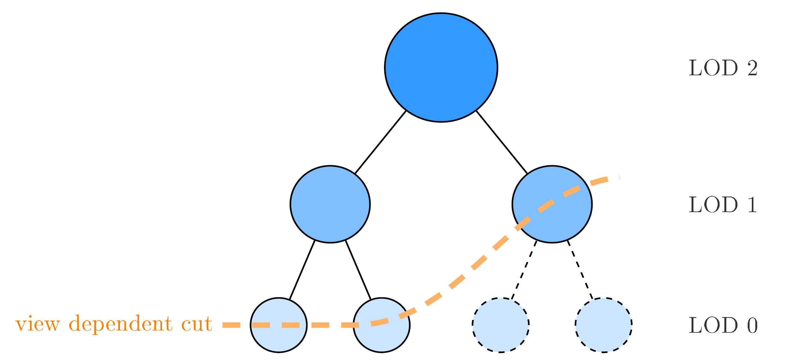
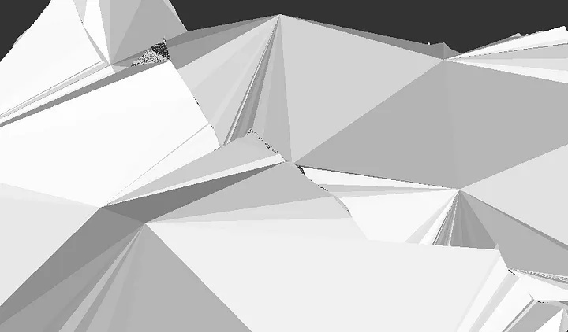
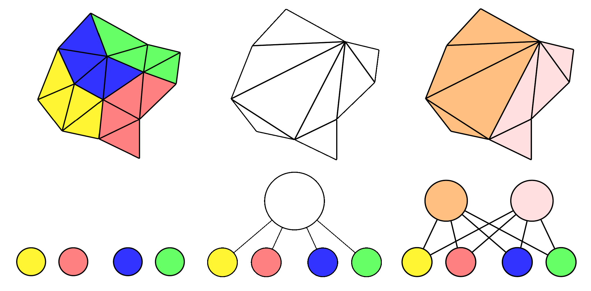
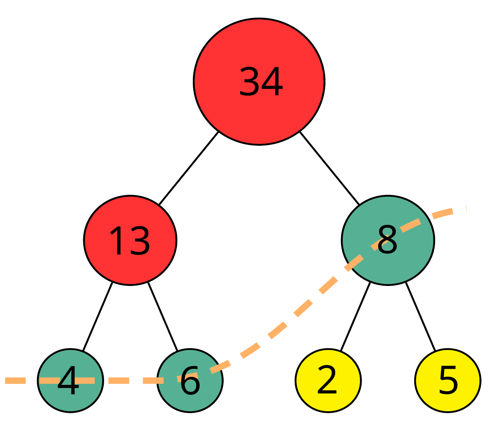

TODO Nanite at home meme?

Why pay Unreal Engine money for their Nanite, when we have Nanite at Home? How hard could it be to replicate it ourselves, with rust-gpu?

* split into multiple posts
* this one about Nanite
* next one about rust-gpu
* why read this? unique perspective: Terrain gen really similar to nanite

<!-- truncate -->    

## Triangles, Vertices, Meshes and Level of Detail

:::tip
Feel free to skip this chapter if you already know all these concepts, but I suspect there will be plenty of rust programmers unfamiliar with computer graphics.
:::

TODO pic of some low poly 3D model

You've probably all seen a 3D mesh made up of many triangles, but how do we actually represent them? The triangles themselves are quite simple, it's just a List of u16 or u32 indices where a set of 3 describe the corner IDs to connect to create a triangle. Far more interesting are these corners, we call them vertices, as they often cary not just the position they are located at, but you can attach various other attributes to them. For example, normals can describe the "up" direction of a surface, which is important in lighting calculations. Or texture coordinates to describe how 2D images should be wrapped around our 3D mesh, think of the wrapper around chocolate Easter bunnies. 

As we're writing a renderer, we don't just want to store models, we want to render them to the screen and look at it from different directions! 
For realtime applications you'd typically use a process called "rasterization" to turn a model into colorful pixels on screen, which includes programmable shaders allowing us to manipulate the appearance of our model:
1. The vertex shader runs once per vertex and calculates where our vertex would end up on the screen, but can also change the other attributes attached to the vertex. 
2. A hardware rasterizer assembles the triangles and figures out where they end up on the screen. It then creates a stream of fragments for each pixel the triangle overlaps.
3. The fragment shader evaluates the color of every emitted fragment.

The cost of rendering scales largely by the shaders that need to be run, or in other words: The amount of pixels on screen plus the amount of vertices of the model. 

TODO pic of some different LOD levels

As we move a model further away from the camera, the mesh gets smaller and fewer fragments need to be evaluated. However, we would still need to call the vertex shader for every single vertex to know where it ends up on screen, even if the detail they describe would be too small to notice. To improve performance, it is common practice to not just have a single mesh, but to create multiple meshes at different Level of Detail (LOD) that can be swapped out, depending on the distance to the camera. The process of reducing the amount of geometry of a mesh is called "mesh simplification", 

## Terrain in video games

You've all played or at least seen Minecraft with its infinite worlds made of blocks. We can't draw infinite amounts of geometry, so we need to segment the world into chunks and only load a small amount of them around the player. And as the player moves in some direction, we load new chunks there and unload the ones behind them.
But that alone doesn't lend itself to far view distances, as chunks further from the camera have just as much geometry as the one the player is standing in.
We need simplified chunks.

<figure>

<figcaption>[image source](https://www.researchgate.net/publication/342611763_General-Purpose_Real-Time_VR_Landscape_Visualization_with_Free_Software_and_Open_Data)</figcaption>
</figure>

Going away from blocks, the image above shows the typical geometry of a single chunk. The white lines indicate the geometry for a 64x64 grid, with a square being represented by 2 triangles each. Compare that to the red geometry representing the same chunk, but by using only an 8x8 grid it has far fewer geometric detail. So by using a smaller grid, we can generate simpler geometry.

<figure>

<figcaption>Source: Continuous Distance-Dependent Level of Detail for Rendering Heightmaps</figcaption>
</figure>

A typical approach is to combine a 2x2 of chunks into one larger chunk at only a quarter of the vertex density. With 4 times as much physical area but a quarter of the density, the new simplified chunk have the exact same amount of triangles and vertices as our detailed chunks, making both chunks cost about the same to render. We can then repeat this process a bunch of times to create less and less detailed chunks, which will eventually lead us to a chunk system like shown above.
There are many physically small and very detailed chunks near the camera and larger, less detailed chunks the further away we get. With the different colors and sizes indicating the various levels of detail (LOD) of each chunk. 

As we iteratively create more and more simplified chunks, you may notice that they're starting to form a tree. Specifically a quadtree, a binary tree in 2 dimensions, where one node splits into four new nodes. In the graph above, we're only visualizing it with two children per node to keep things clearer. To select which chunks to draw at which LOD, we can simply traverse the tree from top to bottom until we hit a node that is "detailed enough" from the view of the camera. Selecting these nodes creates a "cut" though the tree, as defined by graph theory. While evaluating this cut is quite simple in a tree, later on we will come back to calculating the cut in a different kind of graph, where it isn't as trivial.

## Terrain holes

import terrain_hole from './tikz/terrain_hole.png';

<figure style={{float:"right"}}>

</figure>

The biggest issue with LOD Terrain is the creation of holes between different detail levels. In the image above, imagine you are up high looking down on some terrain, with the orange chunk being closer to you and at a higher detail and the blue chunk being further away with less detail. On these LOD transitions, the geometry between the chunks usually doesn't perfectly align, which can result in some visual artifacts. In the lucky case on the right, we may notice that a hill is being cut off. But on the right side, the detailed vertices go below the simplified chunk's height, creating a hole into the void underneath! There's different approaches on how to deal with these holes, and we want to outline some of them here.

<figure>

<figcaption>[image source](https://www.researchgate.net/publication/342611763_General-Purpose_Real-Time_VR_Landscape_Visualization_with_Free_Software_and_Open_Data)</figcaption>
</figure>

TODO different image?

Skirts are a very easy way to circumvent, but not prevent holes. Around each of your chunks, you some extra geometry extending into the ground, creating a skirt. Usually you'd never actually notice the skirt being there, but if you were to look at a hole like in the scenario above, instead of staring into the void you'd be looking at the skirt. This hides the hole in the terrain, but you could still notice the hole by the texture or lighting mismatching with the surrounding terrain. Skirts are also a bad choice if you want to have caves beneath your terrain, as they could easily poke though the ceiling. 

The State of the Art in Terrain Rendering is Vertex Morphing, though we won't go into detail in this article.

<figure>

<figcaption>[image source](https://blog.traverseresearch.nl/creating-a-directed-acyclic-graph-from-a-mesh-1329e57286e5)</figcaption>
</figure>

We'd much rather focus on an approach that at first seems rather counterproductive: What if we never modify the vertices at the chunk borders? This would ensure that the borders between two chunks always match perfectly and have no possibility of ever forming a hole. However, as we simplify our chunks more and more, keeping the very detailed borders around would lead to many very small triangles, like in the image above. And many small triangles, especially elongated ones, are particularly bad for rasterization performance. But it's ability to guarantee no holes while allowing chunks to independently select their level of detail is a very useful property, which we'll exploit in Nanite. 

## Nanite

As we move from Terrain rendering to Nanite operating on general meshes, we have to replace our Chunks with a different concept: Clusters or Meshlets.
While nowadays both are used interchangeably, the original nanite presentation only used the term clusters. Clusters have long been used to describe a small subset of a mesh, usually limited by the amount of triangles it contains.
Whereas the term meshlet comes from the introduction of the new mesh shader. Primarily it's a compute shader that additionally can also emit arbitrary geometry to the rasterization hardware, replacing the vertex shader and any other optional stages before the rasterizer. But mesh shaders have a hardware-dependent limit on how many vertices and triangles can be emitted by a single workgroup. Thus, the term meshlet was born to describe any kind of subset of a mesh that fit within these limits. Vulkan guarantees that mesh shader support at least 64 vertices and 128 triangles, though in practise both AMD and Nvidia have converged on 128 vertices and 256 triangles as being their limits and the optimal size of a meshlet.

In the following visualizations, we will assume that our clusters have a maximum amount of 4 triangles and 6 vertices.

The very first step is to load our mesh from disk using the [gltf crate](https://github.com/gltf-rs/gltf) and turn it into clusters. Luckily, the popular mesh processing library [meshoptimizer](https://github.com/zeux/meshoptimizer) (with rust bindings from [meshopt-rs](https://github.com/gwihlidal/meshopt-rs)) has a convenient function called [`build_meshlets`](https://github.com/gwihlidal/meshopt-rs/blob/c2165927e09c557e717f6fcb6b7690bee65f6c90/src/clusterize.rs#L56) that will turn a mesh into clusters from  for you, in a pretty optimized way. Now that we have clusters, we can start the simplification loop:

1. Select a group of 4 clusters: This would get us the state on the right, with 4 clusters in different colors, and their respective cluster graph at the bottom. Think of it as selecting our "2x2 of chunks" which we want to simplify.
2. Merge the clusters into a single mesh: We forget about clusters for a moment, and just merge the clusters of our group into a single small mesh, which we'll need for the next step.
3. Simplify the clusters with fixed borders: This gets us to the middle state, where we have a white mesh that has been simplified. But most importantly, the outer borders to the surrounding groups are fixed and have not changed at all. This allows us to decide to draw the higher or lower LOD *independently* of our neighbours, which is critical to ensure we don't get any holes in our model though LOD transitions. The meshoptimizer library also provides a simplification implementation, specifically I'm using [`simplify_with_attributes_and_locks`](https://github.com/gwihlidal/meshopt-rs/blob/c2165927e09c557e717f6fcb6b7690bee65f6c90/src/simplify.rs#L193) cause it's very unlikely I'd be able to build a better simplifier than what the rest of the industry uses. In our cluster graph, we deonte it as a new node, who's children are the 4 clusters, similarly to a quadtree in terrain generation.
4. Split the mesh back into clusters: This may seem weird at first, but it's a critical step as we see in a bit. In the right image you can see the newly created border going through our group. Note how this border consists just out of a single long edge and it being a lot longer than all the other edges from the locked border.

import nanite_mesh_3 from './tikz/nanite_mesh_3.jpg';

<figure style={{float:"right"}}>

</figure>

To understand why we split it up into multiple clusters at the end, we need to look at what happens in the next iteration. To start the next iteration, we have to process all groups and collect all the newly generated clusters into a new mesh, like you can see on the right. Then we proceed with the first step again and select groups of 4 clusters. However, there's one detail I've left out earlier: We don't just select *any* group of 4 clusters, we want to select these groups so that there are as few outer edges as possible. Doing so will encourage the grouping algorithm to place the outer edges though longer and more simplified edges, like the edge we created earlier by splitting. Imagine the red lines as the locked borders of the new iteration, and notice how we shifted the locked borders of the previous iteration into the center of the new groups. And my the formerly locked edges being in the center of a group, they can be simplified.

I like to think about it like swapping the areas around constantly: One iteration, one area is a locked border where the other is being simplified. And the next iteration they swap, and the other is the locked border whereas the one is being simplified. But instead of two discrete locations swapping, there are lots of borders throughout the mesh constantly swapping between being locked and being simplified.

You may notice that group selection is an optimization problem of graph partitioning. Luckily there's the [METIS](https://github.com/KarypisLab/METIS) library (and their [rust bindings](https://github.com/lihpc-computational-geometry/metis-rs)), which has implemented decades of research in graph partitioning to allow solving these with almost linear scaling, which is amazing considering any native implementation would likely take exponential or even factorial time to run. It's also surprisingly trivial to use, if you're interested I recommend reading the [docs of `Graph::new`](https://github.com/LIHPC-Computational-Geometry/metis-rs/blob/410f512740476bac38199a3f3d0ab605cd81fe67/src/lib.rs#L230-L302).

## LOD selection

import nanite_mesh_3_dag from './tikz/nanite_mesh_3_dag.png';

<figure style={{float:"right"}}>

</figure>

We've gone into great detail on why we want to split up our mesh again into multiple clusters, but we haven't talked about the kind of graph splitting creates. We've copied the graph from above to the image on the right, and you may immediately notice how the four children clusters now have two parent clusters instead of just one. But each node having exactly one parent is an important property of a tree, making this graph not a tree but an Acyclic Directed Graph (DAG). A Node potentially having multiple parents complicates iteration a lot, as we can't just trivially traverse a DAG like we do a tree, then we could visit nodes multiple times. And we don't want to render a cluster multiple times.

In the original nanite talks, they present an interesting way to select a cut though a DAG. If you have a DAG, like the one above, you can assign each node a monotonically decreasing number, meaning that a node must have a number that is less than that of their parents. Imagine this number somehow representing the detail level, and we are searching for the first node where the detail is smaller than 10, which would select the green nodes. We can find all the green nodes by evaluating the following statement on all nodes: You must only draw when your number is below 10 and your parent's number is above 10. The red nodes fail the first condition, as they are not detailed enough. The yellow nodes fail the second condition, as the green parents above them are already detailed enough. Only the green nodes pass both tests and will be drawn. We can extend this to nodes with multiple parents as well, if we assign each parent the same number. As all parents of some node come from the same group, we can simply calculate this value per group and assign it to all parents. 

But these values are not precomputed constants, after all, moving the camera should change the LOD of objects. Instead, the values come from a function, and we must ensure that for all possible camera positions, the function yields monotonic values throughout the DAG. This depends on the exact function you are using, but generally, this means that your bounding spheres around your clusters must contain all the bounding spheres of your children. Which is a quite simple condition to uphold in practice, though computing the optimal bounding sphere around spheres is a bit complicated, but simpler approximations work just fine. 

## Evaluation

<iframe width="560" height="315" src="https://www.youtube.com/embed/K0du8jCp42I?si=vv40WUSLQ1IZJku5" title="YouTube video player" frameborder="0" allow="accelerometer; autoplay; clipboard-write; encrypted-media; gyroscope; picture-in-picture; web-share" referrerpolicy="strict-origin-when-cross-origin" allowfullscreen></iframe>

Unfortunately, the LOD selection in my implementation is slightly broken, in that it selects a too low LOD way too early, leading to a significant decrease in image quality. So I can't exactly evaluate how much performance is saved by implementing a Nanite-like technique, or compare it to a traditional LOD technique with multiple unique meshes. And I've been trying to fix this on and off over the last few months, trying out two different lod selection algorithms, copying the lod selection from bevy, but still haven't figured out why it's misbehaving. If anything, consider that I've spent a year building all this and still it's not working properly. 

TODO image of simplified tree

And even then, the quality of the LODs isn't great and any 3D artist would be able to do a much better Job than my algorithm. I'd say it can handle natural objects like bolders and most human-made objects with sharp corners quite well. But if you try this algorithm on foliage, it simply looks bad. In the bistro scene itself, you can find two approaches to foliage: Most bushes are made up of many quads with alpha textures arranged seemingly randomly to create a volumetric effect, hardly a solid object, which doesn't simplify well and ends up looking very boxy on low detail levels. The trees and vines are made completely differently as interconnected mesh, which simplifies a lot to often just a few triangles, making the actual vine or leaves on the tree completely disappear. Some scenes with leaves have each individual leaf be its own instance, and would require special handling to first merge all leaves into a single mesh before processing it. Even Unreal Engine didn't support Nanite for foliage at first, likely due to needing to develop these custom algorithms for these special kind of objects. And there's likely a lot more object types that require custom handling as well. You'd likely need completely custom simplification algorithms for each one, and then some sort of algorithm to select which one to use.

TODO bistro image

What I'm getting at is that implementing Nanite is a significant time investment. If the main reason you want to implement Nanite is to gain additional performance, consider all the other options you have, most of which will gain you more performance for the effort invested. But to give somewhat of a performance estimate, I benchmarked my tech demo in 1080p on my Ryzen 9 6900HS's iGPU, which is pretty similar to a steam deck. When I finished my thesis, my demo ran at 13fps (75ms) with maximum detail and 23fps (42.8ms) with my Nanite implementation, at a significant decrease in visual quality. Since then, I implemented (kinda shitty) automated mipmap generation, which alone raised performance to 89fps (11.1ms) on maximum detail, with block-compressed images (like BC7, BC5) squeezing out a bit more at 92fps (10.2 ms). Enabling Nanite now, I'd get 195fps (5.2ms) at way worse visuals, so take this value with a significant grain of salt and expect actual results to be way lower. 

I don't think that implementing Nanite is worth it from a pure performance standpoint, except maybe for AAA studios who have the resources to build it and get it to a good enough quality. But if you want pure performance, you should first focus on getting all the basics out of the way. Like I haven't implemented any form of frustum culling, no two-pass occlusion culling, still use a G-Buffer instead of a Visibility buffer cause it was faster to implement, could likely benefit from batching my draws and should compress my vertex attributes better. All of these will likely have better performance yields for the time invested than implementing Nanite.

I could see Nanite as a tool for artists though, removing their need to manually create LODs and save money in production. However, I can't reasonably give you any recommendations, I'm not an artist myself nor do I know how much time is spent on creating LODs. But there seems to be an active need in that area, since there's multiple companies selling software just for mesh preprocessing and simplification.

## rust-gpu-bindless
* maybe a separate article, coming later?

## Epilog
* link to thesis
* link to other's efforts in reimpl nanite
* searching job
